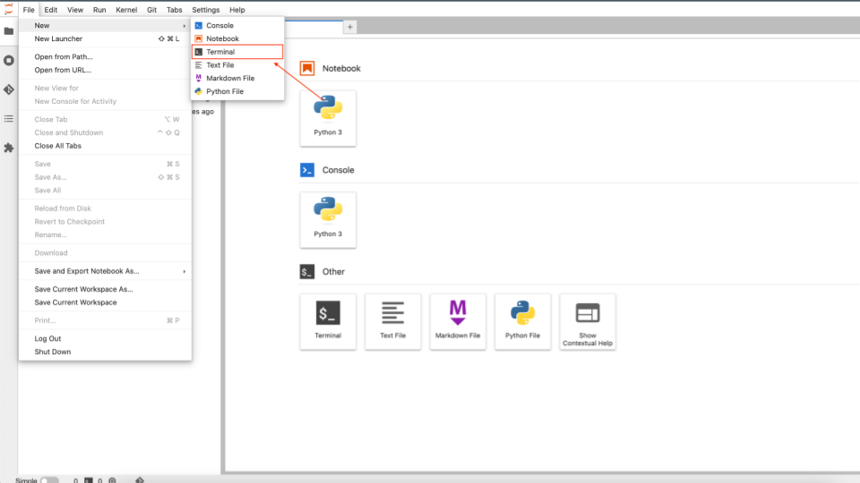

# 🏭 Coal Plant Predictions -- _geospatial-classification_

This model uses satellite data to predict if a coal plant is turned on and producing carbon emissions. The satellite data comes from [Google Earth Engine.](https://earthengine.google.com/)

* **Model**: 1D Fully Convolutional Network in [TensorFlow]
* **Creating datasets**: [Sentinel-2] satellite data from [Earth Engine]
* **Training the model**: [TensorFlow] in [Vertex AI]
* **Getting predictions**: [TensorFlow] in [Cloud Run]

[Cloud Run]: https://cloud.google.com/run
[Sentinel-2]: https://developers.google.com/earth-engine/datasets/catalog/COPERNICUS_S2
[Earth Engine]: https://earthengine.google.com/
[TensorFlow]: https://www.tensorflow.org/
[Vertex AI]: https://cloud.google.com/vertex-ai

## Creating a Google Cloud project

Before you begin, it is recommended to create a new Google Cloud project so that the activities from this lab do not interfere with other existing projects. You may refer to the official documentation ([Creating and Managing Projects]) for detailed instructions.

[Creating and Managing Projects]: https://cloud.google.com/resource-manager/docs/creating-managing-projects

## Running the notebooks

To run the notebooks successfully, follow the steps below.

### Step 0: Select your Google Cloud project

Please make sure you select your own Google Cloud Project you can work on for this Coal Plant Predictions Lab.

### Step 1: Create a User-Manged Notebook instance on Vertex AI Workbench

- Browse to [Vertex AI Workbench](https://console.cloud.google.com/vertex-ai/workbench/list/instances) page, Click on "**USER-MANAGED NOTEBOOKS**" and Click on "**+ NEW NOTEBOOK**" as shown in the image below.

- Please ensure you have selected the correct project when creating a new notebook. Upon clicking the "**+ NEW NOTEBOOK**", you will be presented with a list of notebook instance options. Select `Customize...`, this will give you Python version 3.10.

- Pick a name (or leave it default), select `europe-west2` region and `europ-west2-a` zone, and then click "**CREATE**" to create the notebook instance.

- The instance will be ready when you see a green tick and can click on "**OPEN JUPYTERLAB**" on the [User-Managed Notebooks page]. It may take a few minutes for the instance to be ready.

[User-Managed Notebooks page]: https://console.cloud.google.com/vertex-ai/workbench/list/instances

### Step 2: Open JupyterLab

- Click on "**OPEN JUPYTERLAB**", which should launch your Managed Notebook in a new tab.

### Step 3: Opening a terminal

- Open a terminal via the file menu: **File > New > Terminal**

### Step 4: Cloning the repo

- Run the following code to clone this repo:
    `git clone https://github.com/teamdatatonic/geospatial-classification.git`
    

- You can also navigate to the menu on the top left of the Jupyter Lab environment and click on **Git > Clone a repository**.

- Once cloned, you should now see the **geospatial-classification** folder in your main directory.

### Step 5: Open the README.ipynb

- Follow the instructions in the notebook, and continue through the remaining notebooks.

